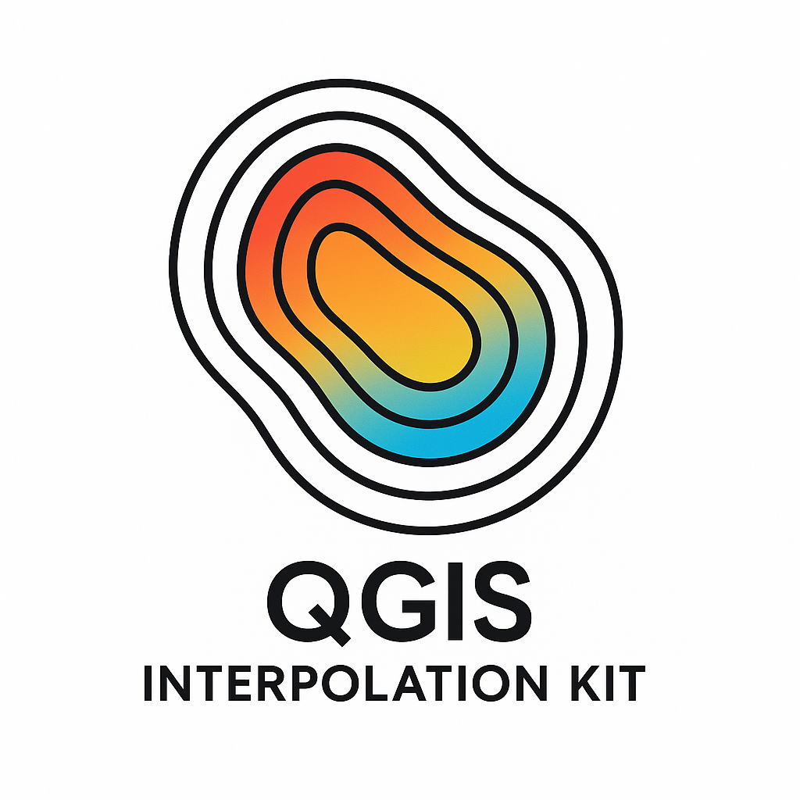

# Kit de Interpolação para QGIS



Kit de ferramentas para interpolação espacial, com suporte a métodos como IDW, Krigagem e geração de modelo potenciométrico. Desenvolvido para eventual integração como plugin do QGIS.

## Funcionalidades

- **Interpolação IDW** (Inverse Distance Weighting)
  - Configuração flexível de expoente, vizinhos e distância máxima
  - Tratamento adequado de casos extremos
  - Opção de valor padrão para células sem vizinhos válidos

- **Krigagem Ordinária**
  - Suporte a diferentes modelos de variograma (esférico, exponencial, gaussiano, linear)
  - Configuração de anisotropia
  - Cálculo de variância de estimativa

- **Modelo Potenciométrico**
  - Cálculo de gradientes e vetores de fluxo
  - Visualização de vetores de fluxo com opções de personalização
  - Análise de superfícies potenciométricas

- **Recursos Adicionais**
  - Sistema de logging para monitoramento detalhado do progresso
  - Testes automatizados com alta cobertura de código
  - Documentação completa com exemplos e tutoriais

## Instalação

```bash
# Instalação via pip (quando disponível)
pip install qgis-interpolagem

# Instalação a partir do código fonte
git clone https://github.com/vmendes93/qgis-interpolagem.git
cd qgis-interpolagem
pip install -e .
```
## Exemplo Rápido

```python
from interpoladores.idw import IDW
from interpoladores.config import IDWConfig
import numpy as np

# Pontos conhecidos
pontos = np.array([[0, 0], [1, 0], [0, 1], [1, 1]] )
valores = np.array([10, 20, 30, 40])

# Grade para interpolação
x = np.linspace(0, 1, 10)
y = np.linspace(0, 1, 10)
grid_x, grid_y = np.meshgrid(x, y)

# Configuração personalizada
config = IDWConfig(power=2.0, n_neighbors=3)

# Interpolação
idw = IDW(config)
z = idw.interpolar(pontos, valores, grid_x, grid_y)
```
## Documentação

A documentação completa está disponível em https://vmendes93.github.io/qgis-interpolagem/

## Requisitos

- Python 3.8 ou superior
- NumPy 1.20 ou superior
- SciPy 1.7 ou superior
- Matplotlib 3.4 ou superior
- PyKrige 1.6 ou superior (para Krigagem)

## Desenvolvimento

Para contribuir com o desenvolvimento:

```bash
# Clone o repositório
git clone https://github.com/vmendes93/qgis-interpolagem.git
cd qgis-interpolagem

# Instale em modo de desenvolvimento
pip install -e .

# Execute os testes
make test

# Gere a documentação
make docs
```
## Licença

Este projeto está licenciado sob a licença MIT - veja o arquivo [LICENSE](LICENSE) para detalhes.

## Autor

Vinicius Mendes - [vmendes93](https://github.com/vmendes93)
