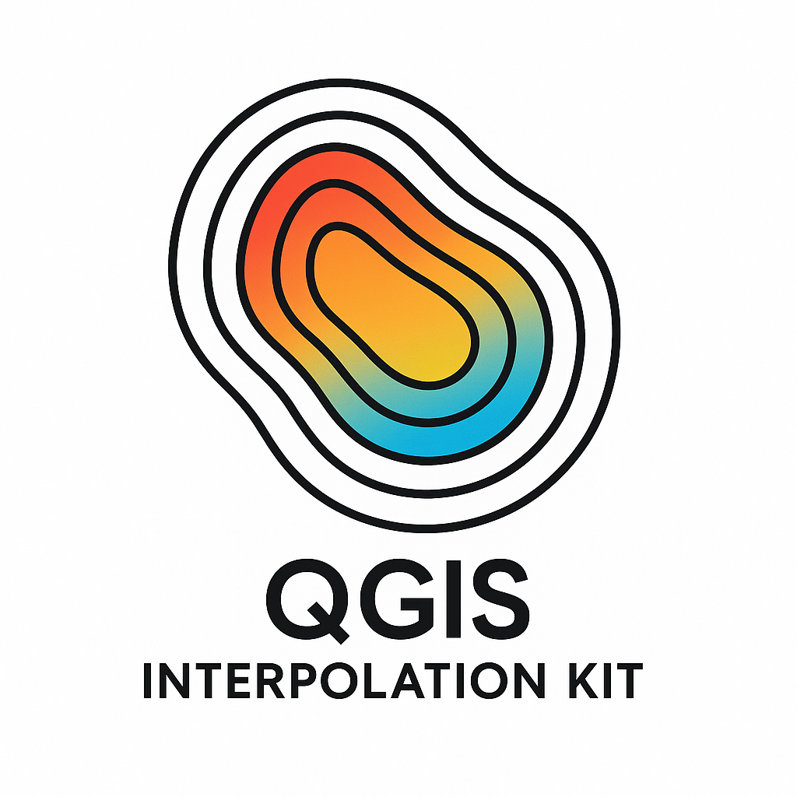

# Kit de Interpolação para o QGIS

**Kit de ferramentas para interpolação espacial, com suporte a métodos como IDW, Krigagem e geração de modelo potenciométrico.**



## Visão Geral

Este projeto fornece uma biblioteca Python para interpolação espacial, com foco em aplicações geoespaciais. Desenvolvido para eventual integração com o QGIS como plugin, o kit oferece implementações robustas de métodos de interpolação comumente usados em geociências, hidrologia e outras áreas que trabalham com dados espaciais.

## Principais Funcionalidades

- **Interpolação IDW** com configuração ajustável de expoente, vizinhos e distância máxima
- **Krigagem Ordinária** com diferentes modelos de variograma e suporte a anisotropia
- **Modelo Potenciométrico** para cálculo de gradientes e vetores de fluxo
- **Sistema de Logging** para monitoramento detalhado do progresso
- **Testes Automatizados** com alta cobertura de código

## Começando

Para começar a usar o Kit de Interpolação:

```python
from interpoladores.idw import IDW
from interpoladores.config import IDWConfig
import numpy as np
```

# Pontos conhecidos
pontos = np.array([[0, 0], [1, 0], [0, 1], [1, 1]])
valores = np.array([10, 20, 30, 40])

# Grade para interpolação
x = np.linspace(0, 1, 10)
y = np.linspace(0, 1, 10)
grid_x, grid_y = np.meshgrid(x, y)

# Configuração personalizada
config = IDWConfig(power=2.0, n_neighbors=3)

# Interpolação
idw = IDW(config)
z = idw.interpolar(pontos, valores, grid_x, grid_y)
